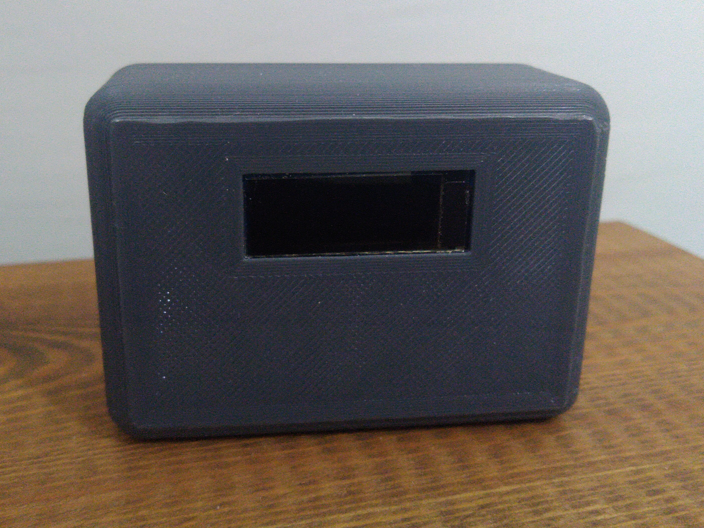
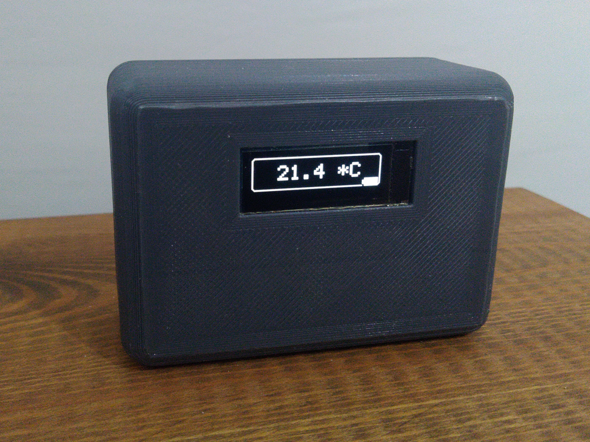
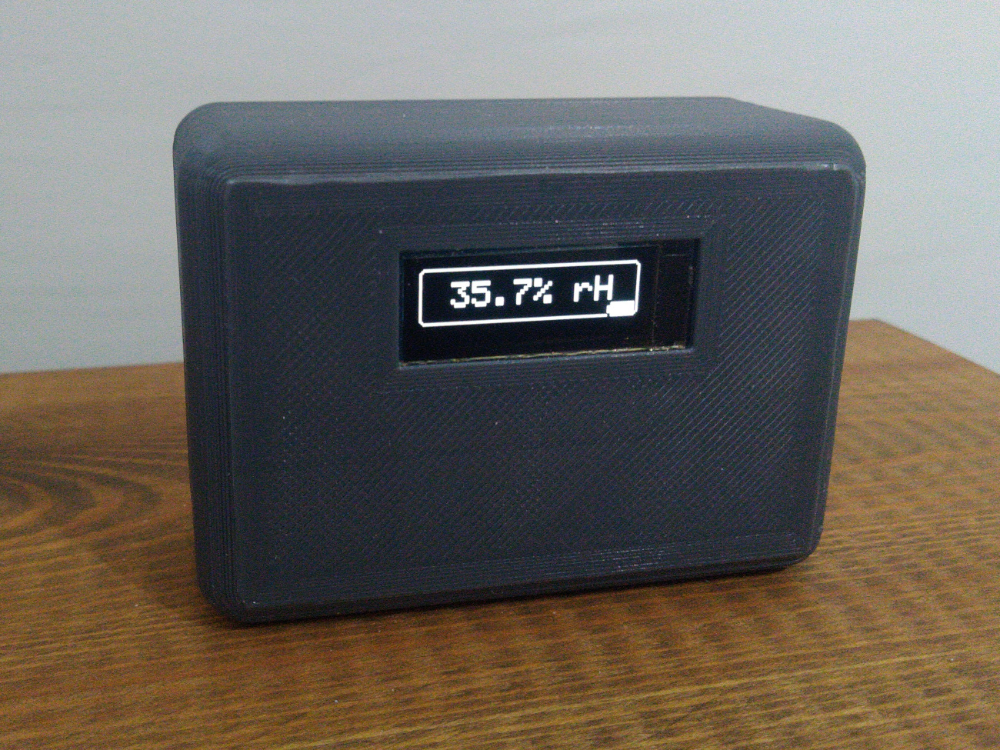
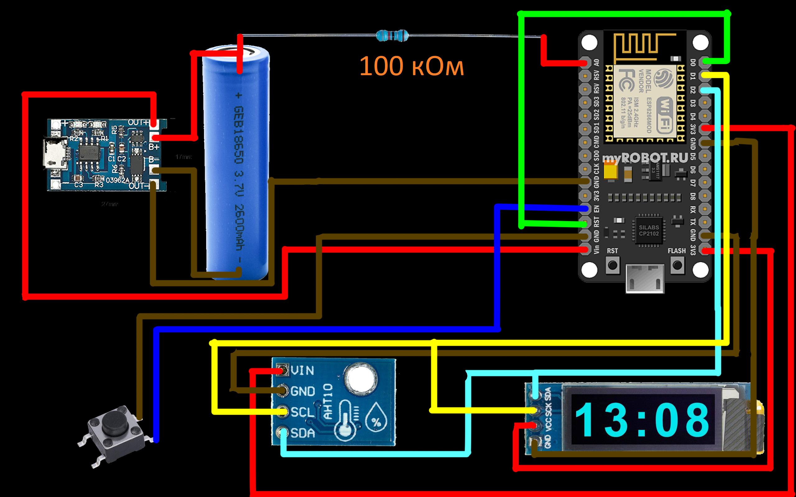
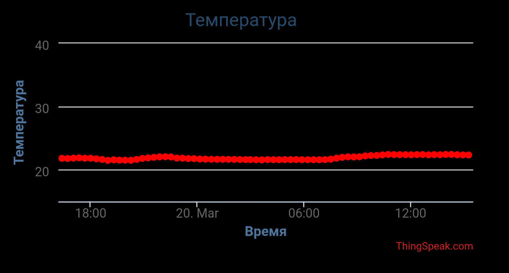
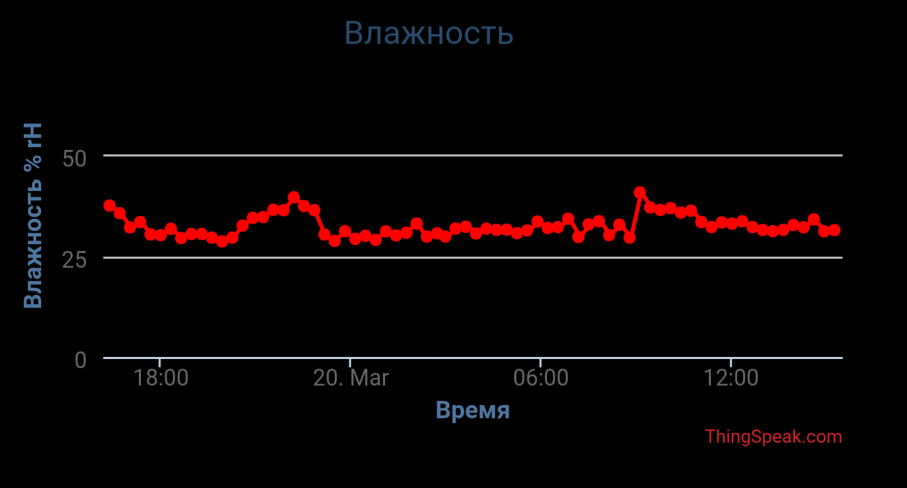

# Thermometer_esp8266

Небольшой проект домашнего термометра.

Основные функции:
1) Вывод температуры на экран
2) Вывод влажности воздуха на экран
3) Запись данных на сервер https://thingspeak.com/

Микроконтроллер, после проверки заряда аккумулятора, автоматически просыпается каждые 20 минут и отправляет данные на сервер.
По нажатию на кнопку выводит последовательно данные на экран. Также выводит актуальный заряд аккумулятора.

Фото:
 

Корпус был напечатан на 3D принтере. 

Схема устройства:
 

Список компонентов:
+ Esp8266
+ Аккумулятор 18650
+ Кнопка
+ Резистор на 100 кОм
+ Датчик AHT20
+ Дисплей SSD1306_128x32
+ Плата зарядки аккумулятора TP4056 

Пример работы на thingspeak.com:
 

